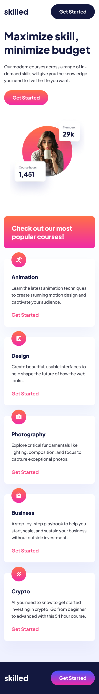
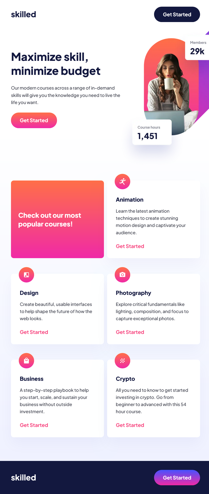
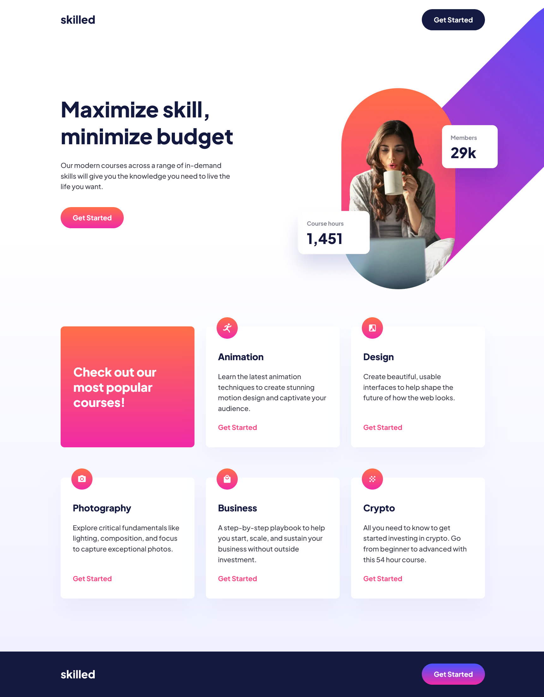

# Frontend Mentor - Skilled e-learning landing page solution

This is a solution to the [Skilled e-learning landing page challenge on Frontend Mentor](https://www.frontendmentor.io/challenges/skilled-elearning-landing-page-S1ObDrZ8q). Frontend Mentor challenges help you improve your coding skills by building realistic projects.

## Table of contents

- [Overview](#overview)
  - [The challenge](#the-challenge)
  - [Screenshot](#screenshot)
  - [Links](#links)
- [My process](#my-process)
  - [Built with](#built-with)
  - [What I learned](#what-i-learned)
  - [Useful resources](#useful-resources)
- [Author](#author)

## Overview

### The challenge

Users should be able to:

- View the optimal layout depending on their device's screen size
- See hover states for interactive elements

### Screenshot

# Mobile View



# Tablet View



# Desktop View



### Links

- Solution URL: [https://github.com/saurav-verma-01/skilled_E-learning_landing_page](https://github.com/saurav-verma-01/skilled_E-learning_landing_page)

- Live Site URL: [https://skilled-webpage.netlify.app/](https://skilled-webpage.netlify.app/)

## My process

### Built with

- Semantic HTML5 markup
- CSS custom properties
- Flexbox
- CSS Grid
- Mobile-first workflow
- [React](https://reactjs.org/) - JS library
- Responsive Images Using - Art Direction, Density Switching and Resolution Switching
- Vite

### What I learned

In completing the Skilled Landing Page challenge for Frontend Mentor, I delved into various technologies and best practices, honing my skills in modern web development. I embraced Semantic HTML5 markup for enhanced accessibility and structure. The use of CSS custom properties, Flexbox, and CSS Grid empowered me to create a flexible and visually appealing layout.

Adopting a mobile-first workflow enabled me to develop a responsive design that seamlessly adapts to various screen sizes. Implementing responsive images was a crucial aspect of performance optimization. Through Art Direction, Density Switching, and Resolution Switching, I ensured an optimal user experience on devices with different screen resolutions and pixel densities.

Integrating React into the project not only provided a dynamic and efficient JavaScript library but also deepened my understanding of component-based architecture. Leveraging performance testing tools such as Lighthouse and PageSpeed Testing allowed me to fine-tune the site for optimal speed and efficiency.

This project provided valuable hands-on experience, reinforcing my knowledge of responsive design principles, performance optimization strategies, and the effective use of modern web technologies. Overall, it was a journey of growth and skill enhancement in frontend development.

## Responsive Image

```react
<picture className="hero-img">
        <source
          // srcset Attribute for Density switching based on DPR of the screen
          srcSet={`${heroDesk1x} 1x, ${heroDesk2x} 2x`}
          media="(min-width: 1280px)"
          width={992}
          height={937}
        />
        <source
          // srcset Attribute for Density switching based on DPR of the screen
          srcSet={`${heroTab1x} 1x, ${heroTab2x} 2x`}
          media="(min-width: 768px)"
          width={640}
          height={640}
        />

        
      </picture>
```

### Useful resources

- [Advanced CSS and Sass: Flexbox, Grid, Animations and More! - by Jonas Schmedtmann ](https://www.udemy.com/course/advanced-css-and-sass/) - This helped me for Learning Deeply about Responsive Images, Its techniques like Resolution Switching, Art Direction and Density Switching using Picture element and ssource attributes. This is the best in depth Advance Css Course where you will learn Advanced topic required in developing a webpage.

## Author

- Frontend Mentor - [@Saurav-98](https://www.frontendmentor.io/profile/Saurav-98)
- Twitter - [@SauravKverma22](https://twitter.com/SauravKverma22)
- Github - [saurav-verma-01](https://github.com/saurav-verma-01)
- Linkedin- [/in/saurav-dev/](https://www.linkedin.com/in/saurav-dev/)

## 🔗 Links

- [](https://github.com/saurav-verma-01)
- [](https://www.linkedin.com/in/saurav-dev/)
- [](https://twitter.com/SauravKverma22)
